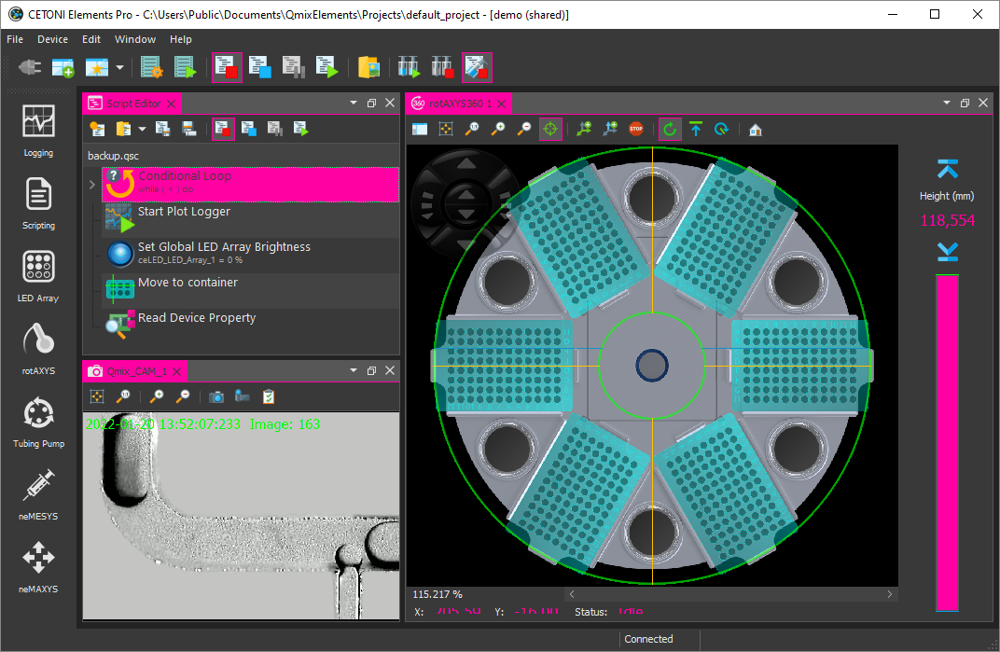

------------------

# Qt Advanced Stylesheets for PySide6

[](https://pypi.org/project/qtass-pyside6/)
[](https://www.python.org/downloads/)

- Original Repository: https://github.com/githubuser0xFFFF/qtass-pyside6
- [Documentation](doc/user-guide.md)

This is the Python version of the [Qt Advanced Stylesheets Project](https://github.com/githubuser0xFFFF/Qt-Advanced-Stylesheets) for C++.

The library allows runtime color switching for CSS stylesheet themes including
SVG resources and SVG icons. The image below shows switching of accent color
and switching between dark and light theme. Notice how the icons in the left 
sidebar change color when switching between dark and light theme.


The main features are:

- runtime switching of CSS colors
- runtime color switching of CSS SVG icons / resources
- runtime color switching of icons loaded via `loadThemeAwareSvgIcon()`
- runtime switching of QPalette colors
- definition of CSS styles that switch the complete application design
- definition of XML color themes that allow switching of theme colors (dark / light)
- switching of individual theme color or switching of accent color
- QML support

If you run the `full_features` example, then you can test the functionality. 
There are some custom dark themes:


And light:


The library allows you to create stylesheets that contain variables that are
replaced at runtime like in this example:

```css
QComboBox:disabled {
  color: {{primaryColor|opacity(0.2)}};
  background-color: {{secondaryColor|opacity(0.75)}};
  border-bottom: 2px solid {{primaryColor|opacity(0.2)}};
}

QComboBox::drop-down {
  border: none;
  color: {{primaryColor}};
  width: 20px;
}
```

## Navigation

- [Navigation](#navigation)
- [Features](#features)
  - [Theme-aware Icons](#theme-aware-icons)
- [Getting started](#getting-started)
- [Run examples](#run-examples)
- [Credits](#credits)
- [Donation](#donation)
- [Showcase](#showcase)
  - [CETONI Elements](#cetoni-elements)

## Features

### Theme-aware Icons

The library supports loading of theme-aware SVG icons.

```python
QtAdvancedStylesheet.load_theme_aware_svg_icon(":/app/images/progress.svg");
```

This allows runtime color switching of application icons like in the
toolbar below.


## Getting started

Have look into the file `CMainWindow` in the full_features example to learn
ho to use the `CStyleManager`. Here are the basic steps to add the style
manager to your application:

```python
QString AppDir = qApp->applicationDirPath();
QtAdvancedStylesheet AdvancedStylesheet;

// first set the directory that contains all your styles
AdvancedStylesheet.setStylesDirPath(AppDir + "/../../styles");

// now set the output folder where the processed styles are stored. The
// style manager will create a sub directory for each style
AdvancedStylesheet.setOutputDirPath(AppDir + "/output");

// set the current style and select a theme. After these two calls, the output
// folder will contains the generated resoruces and stylesheet.
AdvancedStylesheet.setCurrentStyle("qt_material");
AdvancedStylesheet.setCurrentTheme("dark_teal");

// now you can set the generated stylesheet
qApp->setStyleSheet(StyleManager.styleSheet());
```

## Run examples

The `full_features` example shows a window with almost all widgets to test all 
themes and create new ones.


## Credits

- Uwe Kindler, Project Maintainer
- [GCPDS](https://github.com/UN-GCPDS) - Grupo de control y procesamiento digital de señales

The project is strongly inspired by the great [Qt-material](https://github.com/UN-GCPDS/qt-material) project from [GCPDS](https://github.com/UN-GCPDS) and uses the qt-material stylesheet from this project.

## Donation

If this project help you reduce time to develop or if you just like it, you can give me a cup of coffee :coffee::wink:.

<a href="https://www.paypal.com/cgi-bin/webscr?cmd=_s-xclick&hosted_button_id=85R64TMMSY9T6">
  
</a>

## Showcase

### [CETONI Elements](https://cetoni.com/cetoni-elements/)

The [CETONI Elements](https://youtu.be/xWTpCwCz8dI) software from
[CETONI](https://www.cetoni.com) is a comprehensive,
plugin-based and modular laboratory automation software for controlling CETONI devices using a joint graphical user interface. The software features a powerful script system to automate processes.

CETONI Elements Dark Theme


CETONI Elements Light Theme


PySoWorks Theme
